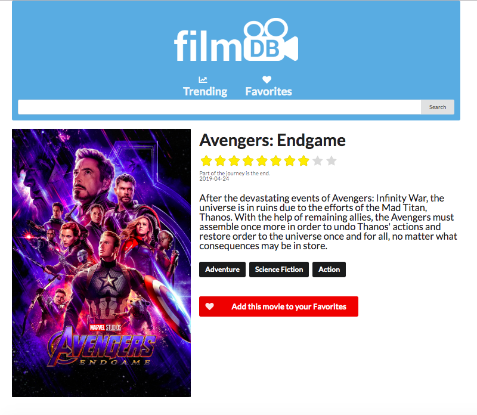
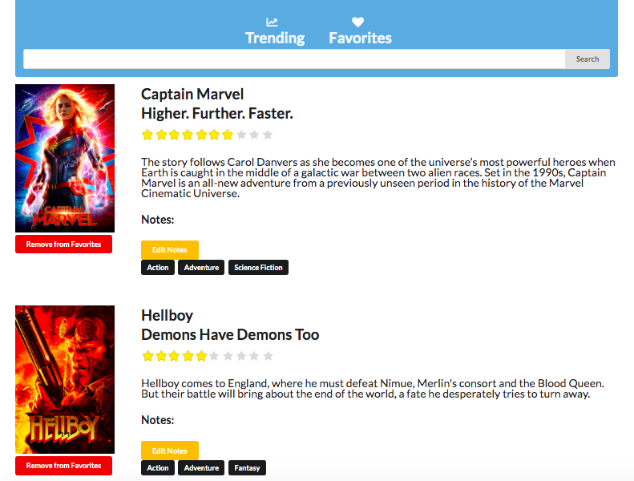

<h1 align='center'>TheFilmDB</h1>

[Live Demo](http://bit.ly/2E3I4iR)

 
 

TheFilmDB is a movie database web application where users can learn about movies they're interested in, and see what movies are trending today. The web app features basic CRUD functionality where users can: 
 
 
- add movies to a 'favorites' page 
- read and learn about each item in the favorites list by clicking on the movie poster 
- update notes for each movie in the favorites list 
- delete movies from the list 
 
 

The web application is built using React.js with state management handled by Redux. Information about trending movies and movie details are fetched from themovieDB API using Axios. All forms used in this web app are handled using Redux-Form. Website navigation is handled using React-Router. 
 
 

**To use**:
 
   
  
  - Head over to https://duyhtruong.github.io/thefilmdb. 
  - The landing page shows a list of current up-to-date trending movies.
  - To learn more about each movie, click on the movie poster.
  - To add a movie to your favorites, in the detail's page of the movie, click 'add to favorites'.
  - To view list of your favorite movies, click 'favorites' in the navigation bar.    
  - To search for a movie, click on the searchbar, input the title of the movie, and submit

